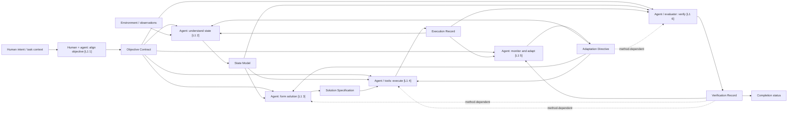

# Artifact Production and Consumption

**Intent:** Decompose L1 functions into evidence-grounded artifact transformations so diagnosis can identify a specific artifact and action.

Source: [actor-artifact-function_ontology.md](../actor-artifact-function_ontology.md). The general form is:

`input artifacts → (actor, action) → output artifacts → (consumer, action)`

A consumer is another actor performing an action. L1 functions classify these actions. Actual actors may be humans, agents, harnesses, tools, or evaluators; determine the allocation from case evidence.

## Artifact meanings and functional decomposition

| L1 action | Inputs | Output artifact | Meaning | Consumed by L1 actions |
| --- | --- | --- | --- | --- |
| 1. Align objective and govern | Human intent, task context | Objective Contract (OC) | What should be achieved and under which constraints | 2, 3, 4, 5, 6 |
| 2. Understand problem and state | OC, environment/observations, ER, AD | State Model (SM) | Current representation of the problem and system | 3, 4, 6 |
| 3. Form solution | OC, SM, AD, VR_d | Solution Specification (SS) | Intended change or action | 4 |
| 4. Execute and coordinate | OC, SM, SS, AD, VR_d | Execution Record (ER) | Actions that occurred and their immediate outcomes | 2, 5, 6 |
| 5. Monitor and adapt | OC, ER, VR | Adaptation Directive (AD) | What should be reconsidered, retried, revised, or recovered | 2, 3, 4, 6_d |
| 6. Verify and decide completion | OC, SM, ER, AD_d | Verification Record (VR) | Success assessment, evidence, and completion status | 3_d, 4_d, 5, completion |

The source lists AD as consumed by function 4; this table also includes it among function 4's inputs. The source's AD_d input to function 6 is expressed consistently on both sides.

`_d` means **method-dependent consumption**, determined by the development method used. It qualifies a consumption edge, rather than defining a new artifact type. Record the method, supporting source, and each such edge's applicability: applicable, inapplicable, or unknown. An applicable edge can still be unobserved or fail; an inapplicable edge's absence is expected. Unknown applicability remains an evidence gap.

## Graph

Solid arrows show production or consumption; dotted arrows show method-dependent consumption. Action-node actor roles are illustrative and must be instantiated from case evidence. The graph describes possible repeated activity; each case uses timed artifact versions and action events.

An Execution Record describes actions and outcomes; inspect the resulting code/system state separately to establish whether that record is accurate. Likewise, a completion status records an assessment whose justification must be evaluated.

## Case reconstruction

Use two compact records, allowing unknown values with reasons:

| Artifact ID/version | Type and concrete content | Source locator | Production time | Producing actor/action and L1 | Observed / inferred / unobserved |
| --- | --- | --- | --- | --- | --- |

| Input ID/version | Consuming actor/action, L1, time | Expected consumption and method applicability | Availability evidence | Actual-use evidence | Output ID/version | Deviation or gap |
| --- | --- | --- | --- | --- | --- | --- |

Assign event IDs where an action repeats. Preserve versions across revisions and feedback loops; a later artifact cannot establish what was available earlier. Record the input bundle for each material action and trace its outputs to subsequent consuming actions. Mark all six functions observed, inferred, unobserved, or outside the analysis boundary.

Artifacts are semantic roles. A document, code fragment, tool result, or recorded reasoning may realize one; one physical source can contain multiple roles, and one artifact can span sources. Use source spans to distinguish them. A missing dedicated file does not establish a missing artifact. An inferred State Model needs cited behavioral evidence and remains an inference.

Availability and use require separate evidence. Delivery into a context establishes availability; explicit references, arguments, or resulting actions may establish use. Logging gaps leave these uncertain.

## Attribution and discriminating evidence

Supply candidate deviations to causal research using:

`input artifact/version → (actor, action, L1) → output artifact/version → (consumer, action, L1) → outcome`

| Candidate deviation | Evidence that distinguishes it | Intervention target if supported |
| --- | --- | --- |
| Inadequate input | Input content at action time compared with objective or actual state | Upstream artifact production or refresh |
| Incorrect transformation | Adequate available inputs, action trace, and incorrect output | Producing action |
| Failed handoff | Correct output exists; delivery, truncation, routing, or access evidence | Transfer into the consuming action |
| Incorrect consumption | Correct version is available; use contradicts its relevant content | Consuming action |
| Stale version consumed | Version/timing evidence identifies the outdated input actually used | Version selection or synchronization |
| Interaction | Multiple conditions change a specific transformation or handoff | Supported combination of actions or conditions |

These are unranked leads. The dependency determines which mechanism the evidence supports. Trace upstream and preserve rivals when the same output could arise from different paths.

Useful sources include exact instruction/context snapshots, tool arguments and returns, repository revisions, evaluator configuration, and feedback followed by subsequent actions. When authorized, matched replays or narrow checks can distinguish mechanisms. Keep the case's development method and other material conditions explicit when comparing runs.
